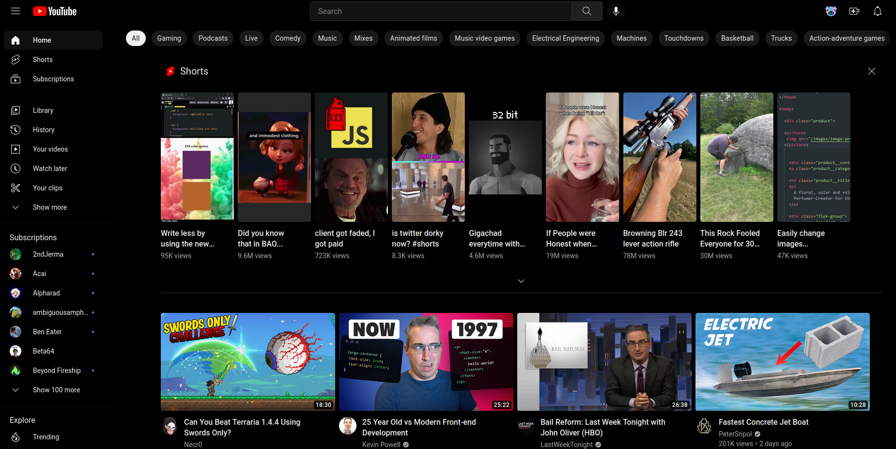
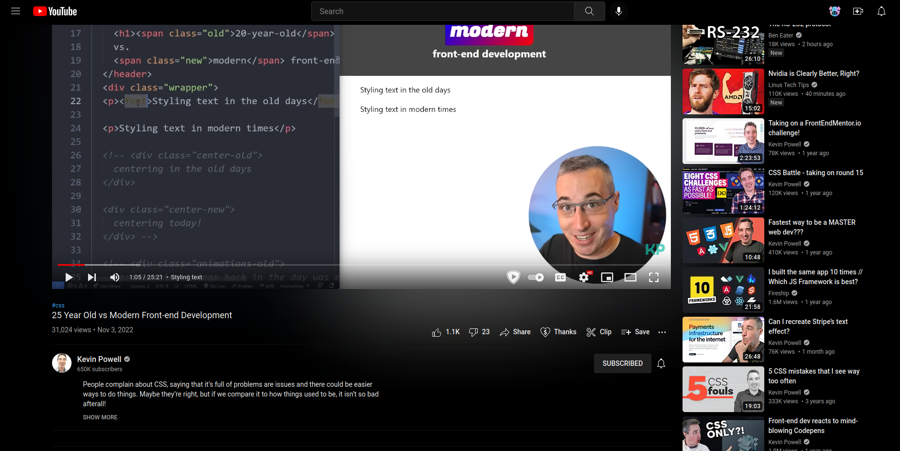

# Midnight UI for YouTube

Theme for YouTube with true black colors in dark mode. Restores part of YouTube's original design, with subtle tweaks. Supports ambient mode.

## How to Install & Use

1. Install [Stylus](https://github.com/openstyles/stylus) [[Firefox Addons](https://addons.mozilla.org/en-US/firefox/addon/styl-us/) | [Chrome Web Store](https://chrome.google.com/webstore/detail/stylus/clngdbkpkpeebahjckkjfobafhncgmne?hl=en)]
2. Head to the style's page: https://userstyles.world/style/7199/midnight-ui-for-youtube
3. Click Install
4. Enable via. the Extention popup while on YouTube
